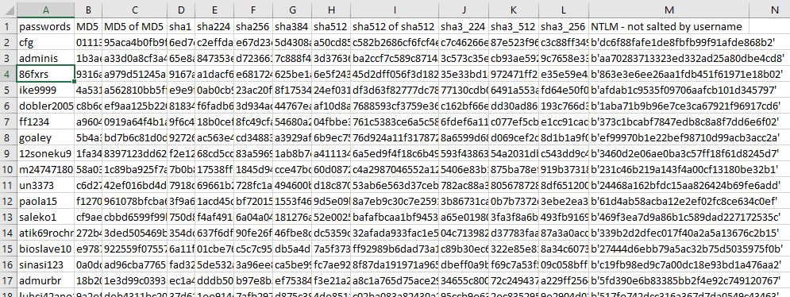

# Rainbow table of password with many hashing algorithm

> A simple hash lookup table, easily expandable to fit your needs

## About The Project

Code running on a [Colab notebook](https://drive.google.com/file/d/1mJ9zukqncci5aexTsJYaePzr_REB3MGG/view?usp=sharing) takes about 3 mins on a GPU instance (the CPU is faster than that of the CPU instance). Output is: `rainbow_table.csv`, which is 833mb.

I have elected to not distrubuted the table, as the compressed file is still > 350mb. I would give the reminder that, Colab lets you download to your local machine. if you get an error, use your Drive as an intermediary

| passwords |	MD5 | MD5 of MD5 |	sha1 |	sha224 |	sha256 |	sha384 |	sha512 |	sha512 of sha512 |	sha3_224 |	sha3_512 |	sha3_256 |	NTLM - not salted by username|
| --- | --- |--- |--- |--- |--- |--- |--- |--- |--- |--- |--- |--- |




## Getting Started

To get a local copy up and running follow these simple steps.

### Runing

Code running on a [Colab notebook](https://drive.google.com/file/d/1mJ9zukqncci5aexTsJYaePzr_REB3MGG/view?usp=sharing) takes about 3 mins on a GPU instance (the CPU is faster than that of the CPU instance). Output is: `rainbow_table.csv`, which is 833mb 

1. Clone the repo

```sh
git clone https://github.com/alik604/This_repo.git
```

2. Open notebook

```sh
jupyter notebook
```

## Roadmap

See the [open issues](https://github.com/alik604/repo/issues) for a list of proposed features (and known issues).

## Contributing

Contributions are what make the open source community such an amazing place to be learn, inspire, and create. Any contributions you make are **greatly appreciated**.

1. Fork the Project
2. Create your Feature Branch (`git checkout -b feature/AmazingFeature`)
3. Commit your Changes (`git commit -m 'Add some AmazingFeature'`)
4. Push to the Branch (`git push origin feature/AmazingFeature`)
5. Open a Pull Request


## License

Distributed under the Unlicense. See `LICENSE` for more information.
